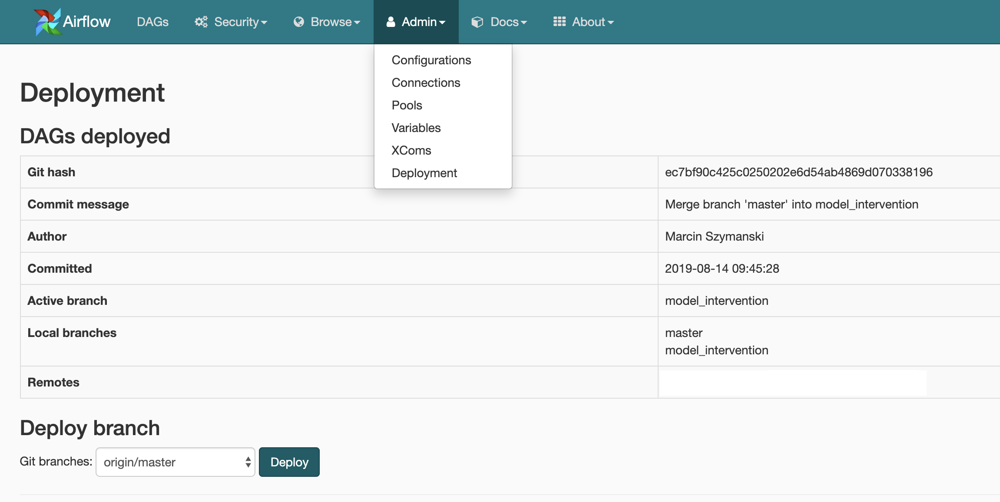

# Airflow Deploy plugin

* Easy deployment of DAGs stored in a Git repo
* No `git pull`, just one click
* See what's deployed to your environment 
* Easily switch branches

## Installation

1) Install `gitpython` in your Airflow webserver Python environment
2) Copy `deploy-plugin` to Airflow plugin folder
3) Make sure your webserver is able to `git pull` your DAGs repo (ssh ket, credentials etc) 

Only RBAC UI is supported.